# Nonnegative Tensor Factorization

> If you can read Japanese, please read my article of Qiita, http://qiita.com/drumichiro/items/14555c3845775e3fe225 and http://qiita.com/drumichiro/items/078c6e0bebf353e40791 (Sorry, Japanese text only).

## INTRODUCTION

These python scripts are to study nonnegative tensor factorization(NTF).
NTF can be interpreted as generalized nonnegative matrix factorization(NMF).
NMF is very common decomposition method,
 which is useful to see essentials from dataset,
 but the method can be just applied to matrix data expressed by 2D.
NTF can analyze more complex dataset than NMF
 so that it can be applied to more than 3D data.

## HOW TO USE

Although the following note is just for python beginners,
 I think the easiest way to run these python scripts is using
 [Anaconda](https://www.continuum.io/downloads).
Anaconda has already set up many packages including `pip`.
If you encounter the error, "module is NOT FOUND",
 please call `pip install <not found package>` on terminal.
 The author confirmed the demo operation on Windows8.1 and cygwin.

### Simple demo

In order to run the demo scripts,
 what you must do is just running **run_ntf_demo_\*.py**.
Here, let's use run_ntf_demo_3rd_order_2bases.py as an example.
In this demo, random samples are generated from two Gaussians in 3D space,
 and the distributions(factors) of each axis are estimated from the samples.
Firstly, the source tensor based on the random samples is showed
 on a left side, and the reconstructed tensor
 from the estimated factors is showed on a right side as a result.

| Source tensor | Reconstructed tensor |
|-----------|------------|
| 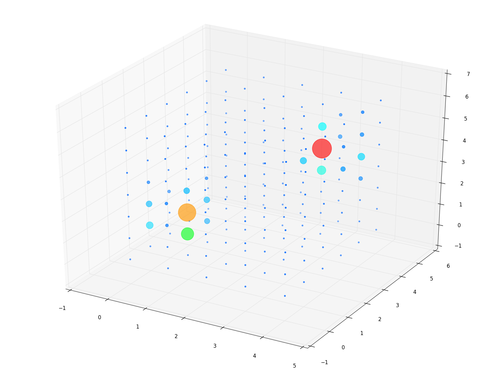 | 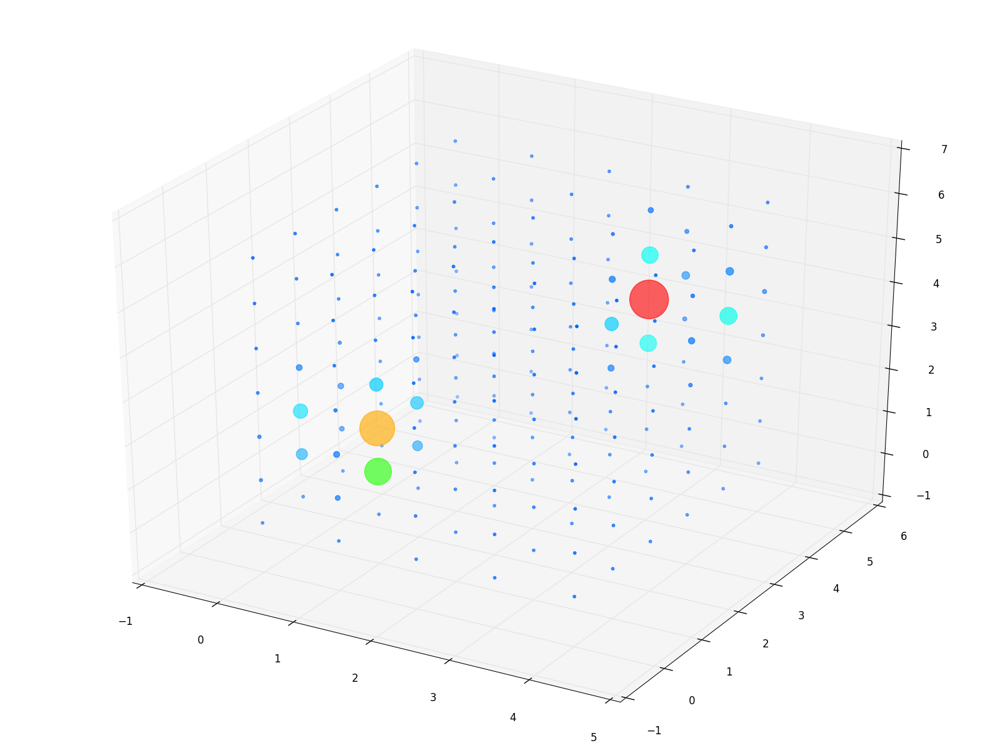 |

We can see the reconstructed tensor is similar to the source tensor,
 so it makes sense that the source tensor was decomposed correctly.
Then, the estimated factors are showed in the following.
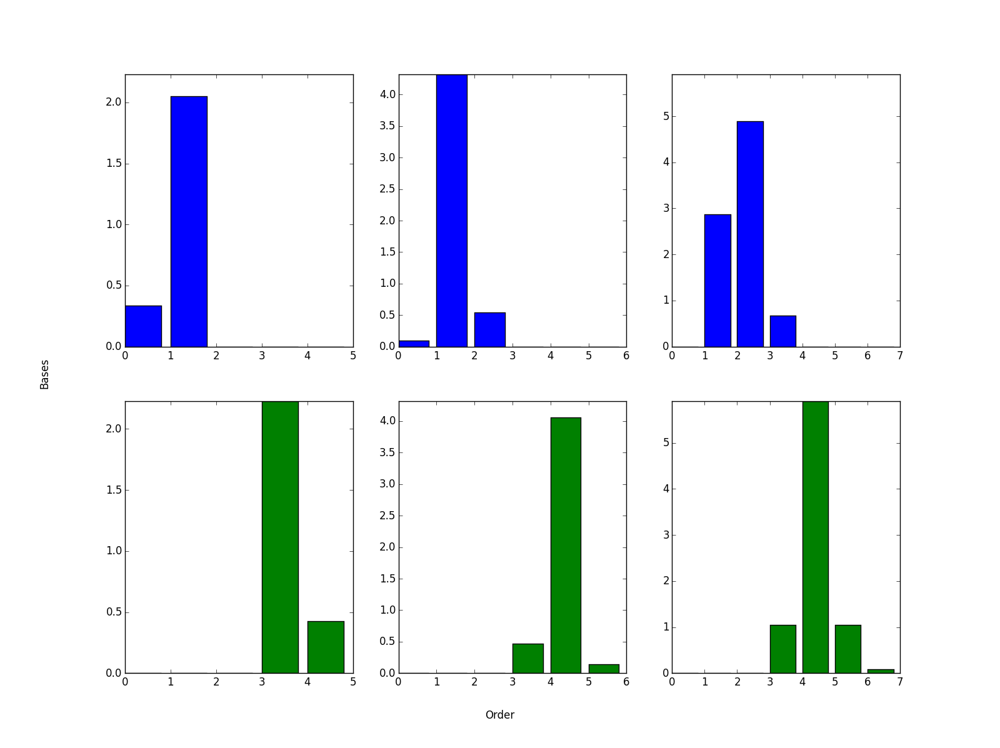

### Demo using coupon purchase data

In order to run the demo scripts, you must get dataset files to use
 before running, which are available from
 https://www.kaggle.com/c/coupon-purchase-prediction/data.
Note that you need to login [Kaggle](https://www.kaggle.com/)
 to get the csv files.
Please put csv files which are obtained
 by unzip of the downloaded zips under "/data" directory.
After these steps, you can check the demos
 by running **run_ntf_ponpare_coupon_\*.py**.
Here, let's use run_ntf_ponpare_coupon_3rd_order.py as an example.
The source tensor is showed in the following.
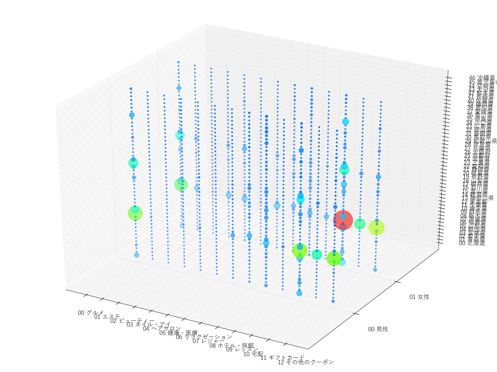
X-axis, Y-axis and Z-axis are
 13 Genre names, 2 sex IDs and 47 prefectures in Japan respectively.
Sorry for the inconvenience caused by Japanese labels to English readers.
I saw the csv files where the contents are translated into English
 or translation scripts provided by volunteers at
 https://www.kaggle.com/c/coupon-purchase-prediction/scripts.
If you want to know the meaning of Japanese labels, I recommend to use these.

As a result, the decomposed factors using 5 bases are showed in the following.
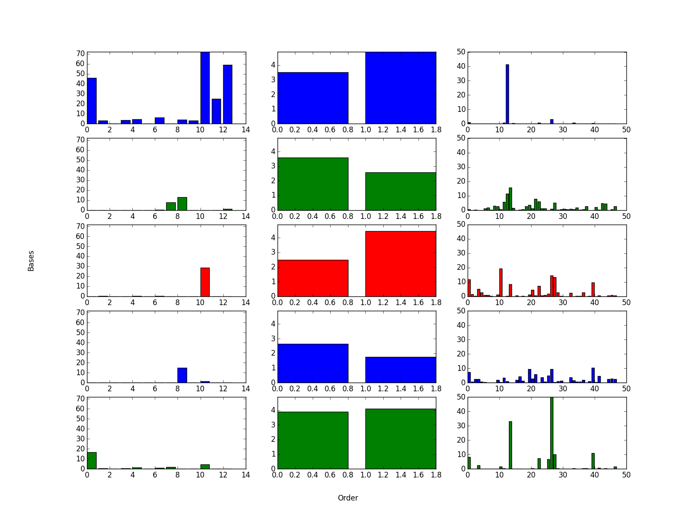
You can see the trends of coupon genres related to the attributes of users
 (e.g., women in every prefecture across Japan order delivery service,
 men in every prefecture across Japan use hotel service, etc.).

## DERIVATION OF UPDATE EQUATION

The update equation can be derived using
 that a cost function value become minimal
 when the partial differentiation of a cost function equals zero.
Overview is that all.

### Definition of cost function

$\beta$ divergence is used as a cost function of NTF.
Especially in this document, generalized KL divergence is covered,
 which is a specific form of $\beta$ divergence.
A vector decomposed from $R$ th order tensor is expressed as
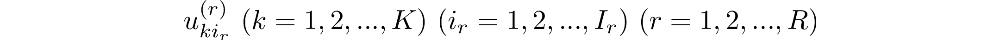
Here, $K$, $I_{r}$ and $i_{r}$ are the number of bases,
 the number of elements of each vector and
 the index of elements of each vector respectively.
When $L$ is dealt with as an aggregate of element number of each order,
 the tensor component approximated by Kronecker product of vectors
 is the following.

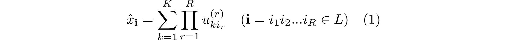

Therefore, the cost function based on generalized KL divergence is the following.

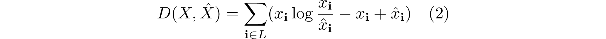

When the approximated tensor $\hat{X}$ is completely matched up
 to the observed tensor $X$, the cost function $D$ equals zero.
After assigning Eq(1) to Eq(2), we obtain
 a sum form of $\log$ transformed from a fraction inside $\log$ in the following.

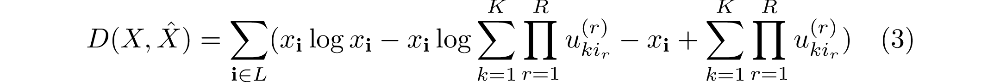

### Partial differentiation of cost function

Our purpose is to calculate the partial differentiation of $u_{ki_{r}}^{(r)}$.
However, it is difficult to differentiate this equation partially directly
 because the second term is a **log-sum form**
 ( $\log\sum_{k}f_{k}(u_{k{\bf i}})$ ).
Therefore, the following variable,

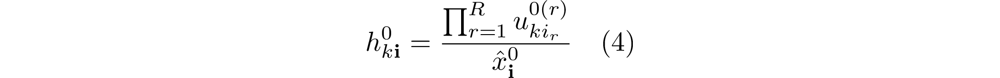

is defined, which has a property of
 $\sum_{k=1}^{K} h_{k{\bf i}} = 1, h_{k{\bf i}} \geq 0$.
Here, the zero number on right shoulder of each variable means
 the variable is before update.
multiplying the second term of Eq(3) by $h_{k{\bf i}}/h_{k{\bf i}}(=1)$
 which consists of Eq(4),
 and applying Jensen's inequality derive the maximal value of the second term
 which has a **sum-log form** ( $\sum_{k}\log f_{k}(u_{k{\bf i}})$ ) as follows.

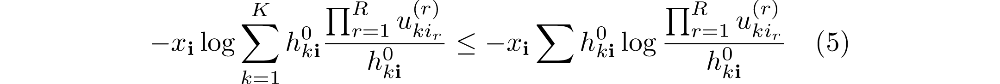

Eq(5) are assigned to Eq(3) so that
 the maximal value of the cost function is derived in the following.

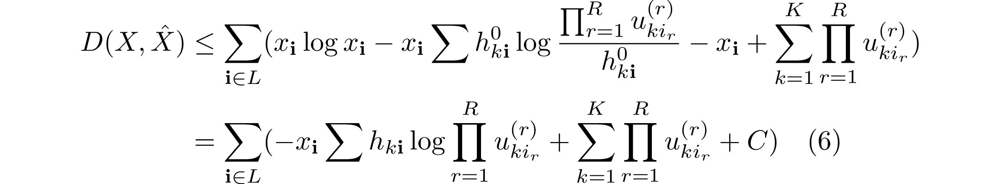

Here, just for simple expression,
 some terms which don't include $u_{ki_{r}}^{(r)}$ are replaced
 with a constant term $C$ because the $C$ becomes zero
 after partial differentiation.
In order to minimalize the maximal value of the cost function,
 the following is obtained by assigning zero to
 what is derived by differentiating Eq(6) partially.

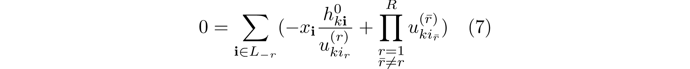

Here, $L_{-r}$ is the aggregate as
 ( $\bar{\bf i} = i_{1}...i_{r-1}i_{r+1}...i_{R} \in L_{-r}$ ).
Eq(7) is summarized in $u_{ki_{r}}^{(r)}$ using Eq(4),
 so that the following update equation is obtained.

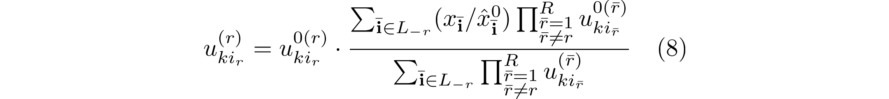

## REFERENCE
- Koh Takeuchi et al.: _Non-negative Multiple Tensor Factorization_
- And many Japanese technical articles. Please see the more description
  about references in my article of Qiita, http://qiita.com/drumichiro/items/14555c3845775e3fe225 and http://qiita.com/drumichiro/items/078c6e0bebf353e40791 (Sorry, Japanese text only).
